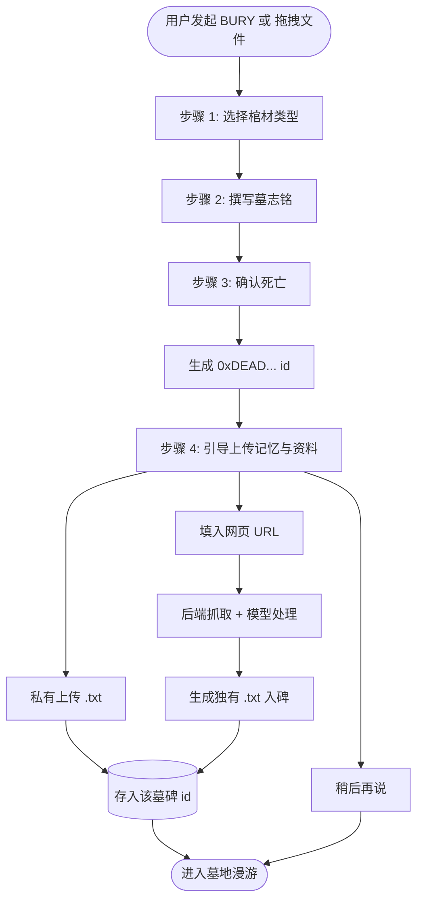

# 0xRIP 前端交互整体架构图

本文档用 **Mermaid** 画出前端交互的整体架构与主流程，便于设计与实现时对齐。在支持 Mermaid 的 Markdown 预览（如 GitHub、Cursor、VS Code 插件）中可直接渲染为图。

→ 叙事版（探墓人完整故事线）：[Story](../story/README.md)  
→ UI 交互规范：[ui.md](./ui.md)

---

## 一、整体架构分层

```
┌─────────────────────────────────────────────────────────────────────────┐
│                        探墓人 (Tomb Visitor)                             │
└─────────────────────────────────────────────────────────────────────────┘
                                      │
                                      ▼
┌─────────────────────────────────────────────────────────────────────────┐
│  入口层：终端式指令 + 3D 墓地场景 (Three.js) + 2D UI 叠加 (CRT/Glitch)   │
│  BURY | SUMMON | MOURN | LIST | DECAY | 自然语言 / 斜杠命令               │
└─────────────────────────────────────────────────────────────────────────┘
                                      │
          ┌───────────────────────────┼───────────────────────────┐
          ▼                           ▼                           ▼
┌─────────────────┐       ┌─────────────────┐       ┌─────────────────┐
│  场景 A         │       │  场景 B          │       │  场景 C          │
│  埋葬仪式       │       │  墓地漫游         │       │  招魂仪式         │
│  (Onboarding)   │       │  (Exploration)   │       │  (Resurrection)  │
└────────┬────────┘       └────────┬────────┘       └────────┬────────┘
         │                          │                          │
         ▼                          ▼                          ▼
┌─────────────────────────────────────────────────────────────────────────┐
│  数据与后端：墓碑 id、people/、记忆与资料、LLM/VLM/Voice、时间线加工      │
└─────────────────────────────────────────────────────────────────────────┘
```

对应 Mermaid 图如下（若需在文档内直接渲染可复制到支持 Mermaid 的编辑器中查看）：


---

## 二、入口与场景关系（指令 → 场景）


---

## 三、埋葬仪式完整流程（含步骤 4 上传记忆）



---

## 四、墓地漫游中「点击墓碑」的交互链


---

## 五、招魂仪式流程


---

## 六、前端技术栈与分层（实现视角）


---

## 七、图例与说明

| 图 | 用途 |
|:---|:---|
| **一、整体架构分层** | 从用户到入口、场景、后端的数据与职责分层。 |
| **二、入口与场景关系** | 终端/自然语言指令如何映射到具体场景与动作。 |
| **三、埋葬仪式完整流程** | 步骤 1～4 及 id 生成后上传记忆/URL、后端处理的顺序。 |
| **四、点击墓碑交互链** | 墓地漫游中悬停/点击/长按墓碑后的分支与「此人一生」展示。 |
| **五、招魂仪式流程** | 从输入 id 到验证、幽灵再现、对话的流程。 |
| **六、前端技术栈与分层** | 实现时表现层、3D、交互、状态、API 的划分。 |

如需导出为 PNG/SVG，可使用 [Mermaid Live Editor](https://mermaid.live) 或 VS Code 的 Mermaid 插件将上述代码块导出为图片后放入设计稿或 README。
